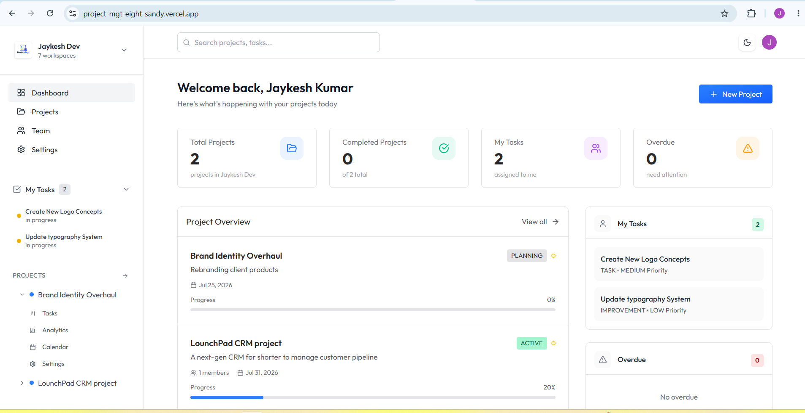
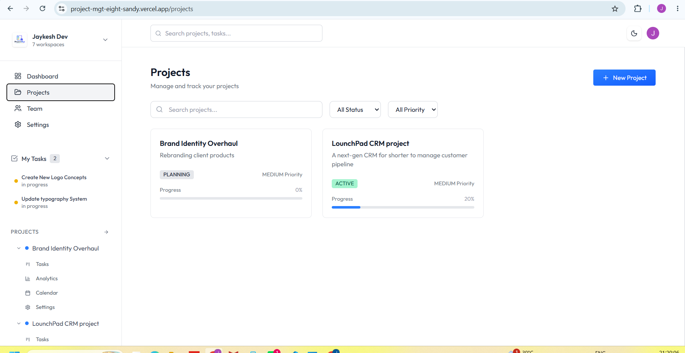
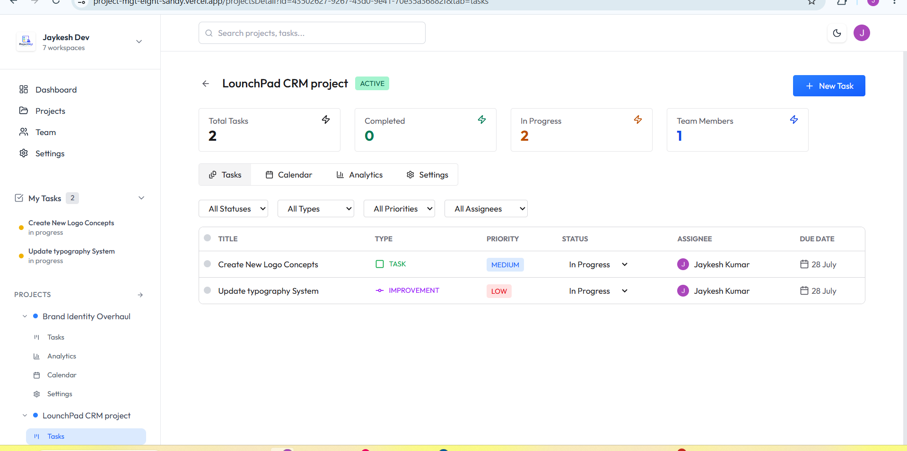

\# Project Management SaaS


A full-stack project management platform for organizing workspaces, managing projects, assigning tasks, collaborating with team members, and tracking progress from a centralized dashboard.


The application supports organization-based workspaces, role-based access, project and task management, team invitations, task assignment, due-date tracking, and automated email notification workflows.


\## Live Demo


\*\*Application:\*\* https://project-mgt-eight-sandy.vercel.app/


> Authentication is required. Sign in to create or join a workspace and access project management features.


\---

## Screenshots

### Dashboard



### Projects



### Task Management



---


\## Features


\### Workspace Management


\- Create and manage organization-based workspaces

\- Switch between multiple workspaces

\- Invite team members to a workspace

\- Support member and admin roles

\- Manage workspace-specific projects and teams


\### Project Management


\- Create projects with name, description, status, and priority

\- Configure project start and end dates

\- Assign a project lead

\- Add workspace members to projects

\- Update project details and progress

\- View project-specific tasks and team members


\### Task Management


\- Create tasks within projects

\- Assign tasks to project members

\- Set task type, priority, status, and due date

\- Track `TODO`, `IN\_PROGRESS`, and `DONE` states

\- View tasks assigned to the signed-in user

\- Identify overdue and in-progress tasks

\- Update and delete tasks


\### Dashboard


\- Workspace-level project statistics

\- Total project overview

\- Completed project tracking

\- Personal task summary

\- Overdue task tracking

\- In-progress task tracking

\- Project overview and recent activity sections


\### Authentication and Team Collaboration


\- User authentication with Clerk

\- Organization-based workspace management

\- Team invitation workflow

\- Active organization switching

\- Protected backend routes

\- Role-based authorization checks

\- Project-lead permission checks


\### Notifications and Background Workflows


\- Event-driven task assignment workflow

\- Email notifications for assigned tasks

\- Due-date reminder workflow for incomplete tasks

\- Background job orchestration with Inngest

\- SMTP-based transactional email delivery


\### User Interface


\- Responsive dashboard layout

\- Light and dark theme support

\- Reusable dialogs and components

\- Sidebar navigation

\- Loading and error feedback

\- Toast notifications for user actions


\---


\## Tech Stack


\### Frontend


\- React.js

\- Vite

\- React Router

\- Redux Toolkit

\- Tailwind CSS

\- Clerk React SDK

\- Axios

\- Lucide React

\- React Hot Toast

\- date-fns


\### Backend


\- Node.js

\- Express.js

\- Prisma ORM

\- PostgreSQL

\- Clerk authentication

\- Inngest

\- Nodemailer


\### Infrastructure and Services


\- Neon PostgreSQL

\- Clerk

\- Inngest

\- Brevo SMTP

\- Vercel


\---


\## Architecture


The project follows a separated client-server architecture:


```text

project-management-saas/

├── client/

│   ├── src/

│   │   ├── app/

│   │   ├── assets/

│   │   ├── components/

│   │   ├── configs/

│   │   ├── features/

│   │   └── pages/

│   └── package.json

│

├── server/

│   ├── configs/

│   ├── controllers/

│   ├── inngest/

│   ├── middleware/

│   ├── prisma/

│   ├── routes/

│   ├── server.js

│   └── package.json

│

├── .gitignore

└── README.md

```


The React client handles the user interface, routing, and application state. The Express backend manages business logic, protected operations, and database access.


PostgreSQL stores application data, Prisma ORM provides the data-access layer, Clerk handles authentication and organization workflows, and Inngest manages asynchronous task-related workflows.


\---


\## Core Data Model


The application is organized around the following entities:


```text

User

&#x20;│

&#x20;├── WorkspaceMember

&#x20;│        │

&#x20;│        └── Workspace

&#x20;│               │

&#x20;│               └── Project

&#x20;│                      │

&#x20;│                      ├── ProjectMember

&#x20;│                      │

&#x20;│                      └── Task

&#x20;│                           │

&#x20;│                           └── Comment

```


This structure separates workspace membership, project membership, task assignment, and collaboration data while preserving relationships between entities.


\---


\## Application Flow


1\. A user signs in through Clerk.

2\. The user creates or joins an organization-backed workspace.

3\. Workspace data is synchronized with the application backend.

4\. Authorized members create and manage projects.

5\. Project leads add eligible workspace members to projects.

6\. Tasks are created and assigned to project members.

7\. Task assignment events trigger background workflows.

8\. Assigned users receive task-related email notifications.

9\. Dashboard summaries update from workspace project and task data.


\---


\## Authorization


The backend performs authorization checks before protected operations.


Examples include:


\- Project creation is restricted according to workspace roles

\- Project updates are restricted to authorized users or project leads

\- Only project leads can add members to a project

\- Task assignment is validated against project membership

\- Protected API routes require authenticated requests

\- Workspace and project membership are validated before sensitive operations


Authentication tokens are attached to API requests from the client and verified by the backend.


\---


\## API Overview


\### Workspaces


```http

GET /api/workspaces

```


Fetch workspaces available to the authenticated user.


\### Projects


```http

POST /api/projects

PUT /api/projects/:id

POST /api/projects/:projectId/addMembers

```


Create projects, update project details, and add members to a project.


\### Tasks


```http

POST /api/tasks

PUT /api/tasks/:id

DELETE /api/tasks

```


Create, update, and delete project tasks.


> API endpoints require authentication where protected by backend middleware.


\---


\## Getting Started


\### Prerequisites


Make sure the following are installed:


\- Node.js

\- npm

\- PostgreSQL-compatible database

\- Clerk application credentials


\### 1. Clone the Repository


```bash

git clone https://github.com/JAYKESH-KUMAR/project-management-saas.git

cd project-management-saas

```


\### 2. Install Client Dependencies


```bash

cd client

npm install

```


\### 3. Install Server Dependencies


Open another terminal from the project root:


```bash

cd server

npm install

```


\### 4. Configure Environment Variables


Create environment files locally for the client and server.


\#### Client Environment


Create a `.env` file inside the `client` directory:


```env

VITE\_CLERK\_PUBLISHABLE\_KEY=

VITE\_BASE\_URL=

```


\#### Server Environment


Create a `.env` file inside the `server` directory:


```env

DATABASE\_URL=

CLERK\_SECRET\_KEY=


INNGEST\_EVENT\_KEY=

INNGEST\_SIGNING\_KEY=


SMTP\_HOST=

SMTP\_PORT=

SMTP\_USER=

SMTP\_PASS=

```


Environment variable names should match the configuration used in the project.


\*\*Never commit real credentials, database URLs, SMTP keys, or secret keys to version control.\*\*


\### 5. Generate Prisma Client


From the `server` directory:


```bash

npx prisma generate

```


\### 6. Apply Database Migrations


```bash

npx prisma migrate dev

```


\### 7. Start the Backend


From the `server` directory:


```bash

npm run server

```


The API runs locally on:


```text

http://localhost:5000

```


\### 8. Start the Frontend


From the `client` directory:


```bash

npm run dev

```


The Vite development server will print the local application URL in the terminal.


\---


\## Deployment


The application is deployed with external services for hosting, authentication, database storage, background workflows, and email delivery.


\### Production Services


\- Application hosting: Vercel

\- Database: Neon PostgreSQL

\- Authentication and organizations: Clerk

\- Background workflows: Inngest

\- Transactional email: Brevo SMTP


\---


\## Security


\- Secrets are stored in environment variables

\- Authentication is handled through Clerk

\- Protected requests use bearer tokens

\- Backend controllers validate authorization before sensitive operations

\- Project membership is checked before task assignment

\- Role and project-lead permissions are validated server-side

\- Database access is handled through Prisma ORM

\- Environment files are excluded from version control


\---


\## Future Improvements


\- Real-time task discussions and comments

\- File attachments for tasks

\- Activity audit logs

\- Advanced project analytics

\- Task filtering and sorting

\- Notification center

\- Global search across projects and tasks

\- Automated testing

\- CI/CD workflow improvements


\---


\## Author


\*\*Jaykesh Kumar\*\*


B.Tech Computer Science and Engineering student focused on full-stack web development and software engineering.


\- GitHub: https://github.com/JAYKESH-KUMAR

\- Live Project: https://project-mgt-eight-sandy.vercel.app/


\---


\## License


This project is intended for educational and portfolio purposes.

